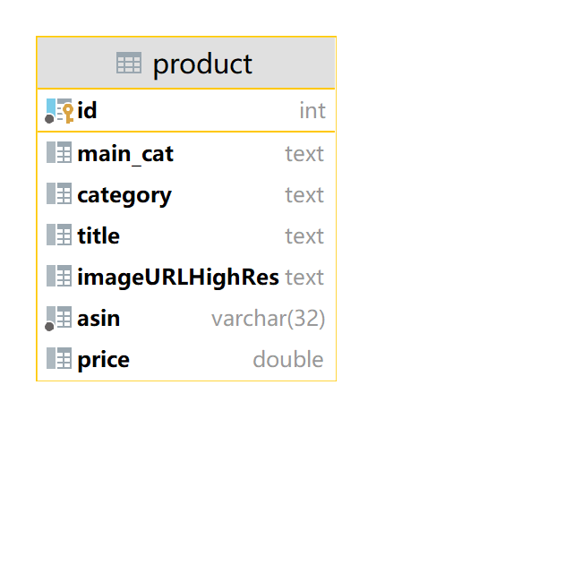

# aw06

## 描述
使用[Amazon Review Data (2018)](https://nijianmo.,github.io/amazon/index.html)的Movies and TV, video game,books三类型商品的数据
作为待处理数据，在处理完以后数据一共有114344条。

数据使用的mysql数据库进行存储，只有product单张表，表的逻辑结构如下图所示。

## 结构
作业使用一个批处理任务完成，任务分为reader, processor,writer三个组件。

### reader
主要负责文件读入，java提供bufferreader进行具体的读入。在读入时，由于有些数据存在不规范情况，不如title中存在这种标签，
所以我选择在转换为jsonObject对象之前先使用正则表达式之前进行简单的处理。

### processor
将reader产生的JsonObject对象转换为目标对象Product。由于reader中简单的清洗，所以该部分可以直接使用objectMapper进行。

### writer
负责将processor中的Product进行持久化,写入mysql数据库中。我使用的是jdbcTemplate构建，然后通过嵌入sql语句的方式完成的。

## aw04
作业要求要修改aw04.将aw04修改成使用该数据作为数据源。该部分见[aw04仓库](https://github.com/sawork-2022/aw04-ai-roboter-1.git)的for-aw06分支。